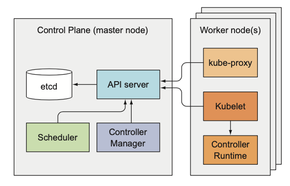

# Kubernetes internals:

## Understanding the architecture

Before you look at how Kubernetes does what it does, let’s take a closer look at the components that make up a Kubernetes cluster. 
 * Kubernetes cluster is split into two parts:
    *  The Kubernetes Control Plane 
    * The (worker) nodes
- Let’s look more closely at what these two parts do and what’s running inside them.
### COMPONENTS OF THE CONTROL PLANE
The Control Plane is what controls and makes the whole cluster function.the components that make up the Control Plane are
  * The etcd distributed persistent storage 
  * The API server
  * The Scheduler
  * The Controller Manager
These components store and manage the state of the cluster, but they aren’t what runs the application containers.
### COMPONENTS RUNNING ON THE WORKER NODES
The task of running your containers is up to the components running on each worker node:
   * The Kubelet
   * The Kubernetes Service Proxy (kube-proxy)
   * The Container Runtime (Docker, rkt, or others)
### ADD-ON COMPONENTS
Beside the Control Plane components and the components running on the nodes, a few add-on components are required for the cluster to provide everything discussed so far. This includes
   * The Kubernetes DNS server
   * The Dashboard
   * An Ingress controller
   * Heapster
   * The Container Network Interface network plugin
### The distributed nature of Kubernetes components
The previously mentioned components all run as individual processes. The components and their inter-dependencies are shown in figure below

  To get all the features Kubernetes provides, all these components need to be running. But several can also perform useful work individually without the other components. You’ll see how as we examine each of them.
  
  
  
### Checking the status of the Control Plane components
The API server exposes an API resource called ComponentStatus, which shows the health status of each Control Plane component. You can list the components and their statuses with kubectl:
```
$ kubectl get componentstatuses
NAME STATUS MESSAGE
scheduler Healthy ok controller-manager Healthy ok
etcd-0 Healthy {"health": "true"}
```
ERROR
